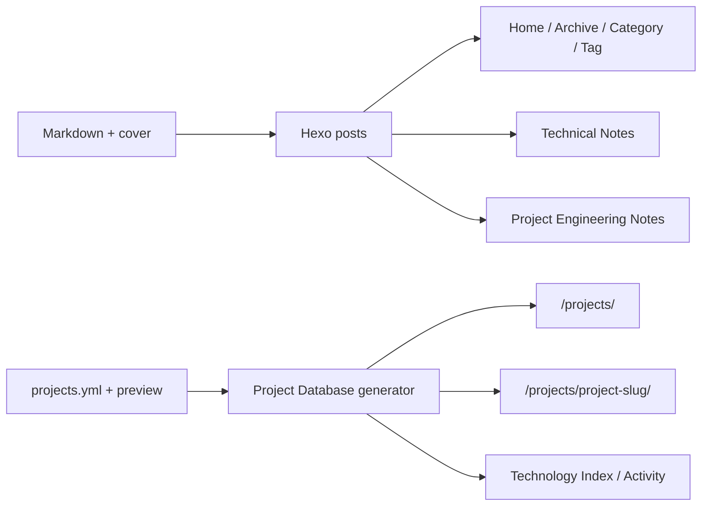

前一篇已经让站点在 Dev Container 中运行起来。现在的问题是：以后每写一篇文章、增加一个项目，是否还要重新设计页面、复制 HTML，或者继续往 CSS 里添加新类？

答案是：**日常内容不需要改页面代码。** 但“所有事情只改 Markdown”也不准确。

- 写普通文章、加入 Notes、把文章关联到已有项目：修改 Markdown，并添加一张图片；
- 新增或维护一个 Project Database record：修改 YAML，并添加项目预览图；
- 两种情况都不需要复制 HTML，也不需要修改 JavaScript、CSS 或 Hexo 生成器。

这篇文章从实际操作出发，把这条边界写清楚。本文所有命令都假定已经进入 Dev Container；如果本地站点还没有运行，先看[从零启动 Kral Publishing System](/2026/08/08/kral-publishing-system-getting-started/)。

## 先看清两条内容路径

博客内容和项目记录使用不同的事实源：



这两条路径最后都会生成普通静态 HTML，但编辑入口不同：

| 想做的事 | 修改什么 | 系统自动完成什么 |
| --- | --- | --- |
| 发布普通文章 | `source/_posts/*.md` + 封面 | 首页、归档、分类、标签和文章页 |
| 让文章进入 `/notes/` | 同一篇 Markdown 增加 `notes_index` | Notes 收录、搜索数据和五种视图 |
| 让文章关联已有项目 | 同一篇 Markdown 增加 `project` | 项目详情页的 Engineering Notes |
| 新增项目 | `source/_data/projects.yml` + 项目图 | 项目列表、详情页、数量和相关索引 |
| 更新项目配置或历史 | 修改已有 YAML record | 重新生成对应区块；空区块自动省略 |

普通文章不需要项目 YAML；项目也不需要创建一份详情页 Markdown。不要把两者混成“每个项目一篇大文章”。项目 record 保存稳定事实，Markdown 保存需要展开叙述的经验和判断。

## 新建一篇最普通的文章

在 Dev Container 终端运行：

```bash
pnpm new:post my-article-slug
```

`my-article-slug` 使用小写英文和连字符，例如：

```bash
pnpm new:post why-i-use-dev-containers
```

它会创建：

```text
source/_posts/why-i-use-dev-containers.md
```

slug 会参与当前的永久链接：

```text
/:year/:month/:day/:title/
```

所以文件发布后尽量不要随意改名。显示标题可以改中文，稳定 slug 不需要跟着变。

新文件只是骨架。至少把下面这份 Front Matter 填完整：

```yaml
---
title: 为什么我使用 Dev Container
date: 2026-08-11 20:00:00
cover: /img/covers/why-i-use-dev-containers.webp
description: 说明 Dev Container 在我的项目中解决了什么问题，以及它没有解决什么。
tags:
  - Dev Container
  - Docker
categories:
  - 开发笔记
---
```

Front Matter 是文件开头两条 `---` 之间的 YAML。它不显示为正文，但会影响 URL、文章列表、分类、标签和封面。

### 每个基础字段负责什么

| 字段 | 作用 |
| --- | --- |
| `title` | 页面显示标题。`pnpm new:post` 初始可能把 slug 放进标题，要把它改成给读者看的文字。 |
| `date` | 文章发布时间。站点时区是 `Asia/Tokyo`，并设置了 `future: false`；日期晚于构建时刻时不会进入正式构建。不要用未来时间把 `_posts` 伪装成草稿。 |
| `cover` | 浏览器使用的站点路径。`/img/covers/example.webp` 对应仓库中的 `source/img/covers/example.webp`。 |
| `description` | 一两句话说明文章回答什么。它会用于列表或元数据，不要简单复制标题。 |
| `tags` | 横向检索词。使用技术名或概念，不需要堆很多近义词。 |
| `categories` | 较宽的归档主题。它和 `tags` 的职责不同，不必把每个 tag 再复制成 category。 |
| `series` | 可选。只有一组文章确实存在共同叙事或阅读顺序时才添加。 |

正文从 `##` 开始：

```markdown
## 问题从哪里出现

正文……

## 我最后怎样处理

正文……
```

页面的 H1 已由主题根据 `title` 生成，正文再写一个 `# 同名标题` 会重复。

## 给文章准备图片

文章封面放在：

```text
source/img/covers/
```

推荐先把图片压缩为 WebP，再使用清楚、稳定的英文文件名：

```text
source/img/covers/why-i-use-dev-containers.webp
```

Front Matter 中写：

```yaml
cover: /img/covers/why-i-use-dev-containers.webp
```

注意两个路径的区别：

```text
仓库文件：source/img/covers/why-i-use-dev-containers.webp
页面 URL： /img/covers/why-i-use-dev-containers.webp
```

正文图片也使用站点 URL：

```markdown

```

`alt` 应描述图片传达的信息，而不是写“图片 1”。

我现在把“一篇文章一张独立封面”当作编辑规则，这能减少整页反复出现同一张图造成的模板感。当前构建不会自动检查视觉重复，所以新增前可以搜索引用：

```bash
rg -n --glob '!public/**' --glob '!node_modules/**' "/img/covers/why-i-use-dev-containers\.webp" .
```

不要把图片放进 `public/img/`。`public/` 是构建结果，下一次 `hexo clean` 可以删除它。

## 一篇文章可以去往三个地方

基础 Front Matter 已经足以生成文章页，并自动进入首页、归档、分类和标签。只有确实需要其他关系时，才添加可选字段。

### 普通博客文章

什么也不用加。不要为了“字段整齐”把所有可选配置塞进每篇文章。

### 技术札记

最可靠的显式写法是：

```yaml
notes_index: true
```

`notes_index: false` 会明确排除。省略时，Notes 生成器只会根据部分技术分类判断，因此新分类下的技术文章最好显式写 `true`。

进入 `/notes/` 的文章还必须有 `cover`。如果想让 Notes 使用与文章页不同的图片，可以写：

```yaml
gallery_image: /img/covers/notes-specific-image.webp
```

当前缺少图片时，Notes 卡片可能直接不渲染，而不是在构建时给出明确错误。因此“文章已经发布，但 Notes 找不到”时，先检查 `notes_index`、分类和图片路径。

### 关联已有项目

如果文章是在解释 Kral Publishing System，可以增加：

```yaml
project: kral-publishing-system
project_type: guide
project_order: 30
```

- `project` 必须是 `projects.yml` 中真实存在的 slug；
- `project_type` 会显示为 Guide、Decision、Case、Incident、Reference 等类型；
- `project_order` 控制 Engineering Notes 中的显式顺序；
- `project_index: false` 可以保留关联，但不在 Engineering Notes 表中显示。

一篇文章也可以关联多个项目：

```yaml
project:
  - kita
  - openlist
project_type: decision
project_order: 40
```

这些字段只声明内容关系，不控制样式。项目页怎样排版，仍由共同生成器和 Tabler 样式统一负责。

## 一个完整的技术文章例子

把基础字段和两种关系放在一起，大致是：

```yaml
---
title: 我如何区分构建成功与部署成功
date: 2026-08-11 21:00:00
cover: /img/covers/build-and-deploy.webp
description: 从一次 Pages 部署失败出发，区分本地构建、Actions build 和 Pages deploy 三种状态。
tags:
  - GitHub Actions
  - GitHub Pages
categories:
  - 建站记录
notes_index: true
project: kral-publishing-system
project_type: incident
project_order: 30
---
```

保存以后，正在运行的 `pnpm dev` 会重新生成页面。检查：

1. 文章 URL 可以打开；
2. 首页或归档中能找到它；
3. `/notes/` 中出现封面；
4. `/projects/kral-publishing-system/` 的 Engineering Notes 中出现标题和类型；
5. 图片、代码块和内部链接正常。

如果 `project` 写成未知 slug，生产构建会失败并指出引用了不存在的项目。这个失败比静默生成断链更安全：应修正 Front Matter 或先创建对应项目，而不是绕过校验。

## 新增项目，不是新建一篇项目 Markdown

项目本身的事实源是：

```text
source/_data/projects.yml
```

新增项目时需要两样东西：

1. `source/img/projects/<slug>.webp` 项目预览图；
2. `projects.yml` 中的一条结构化 record。

不需要创建：

```text
source/projects/<slug>/index.md
```

也不需要复制 Kita 的 HTML 或为 P-004 新建 CSS。生成器会根据 slug 自动创建 `/projects/<slug>/`。

### 先添加项目图

例如：

```text
source/img/projects/my-project.webp
```

Project Database 首页的项目行会使用 `card.image`。这个字段当前不能省略。

### 再追加一条项目 record

在顶层 `projects:` 列表中，与现有的 `- id: P-001`、`- id: P-002` 同级追加一项。YAML 缩进只使用空格，不要使用 Tab，也不要把项目粘贴到 `technology_catalog` 下。

先填下面这些字段；没有内容的区块以后再加：

```yaml
  - id: P-004
    order: 4
    slug: my-project
    title: My Project
    subtitle: A small personal application
    description: 一句话说明这个项目实际解决什么问题。
    summary:
      what: 它向使用者提供什么。
      why: 为什么需要单独做这个项目。
      boundary: 哪些事情明确不由它负责。
    classification: Application
    status:
      active: true
      short: Active
      detail: Active development
    started:
      iso: '2026-08-11'
      display: '2026.08.11'
    updated:
      iso: '2026-08-11'
      display: '2026.08.11'
    period: 2026 — Present
    card:
      image: /img/projects/my-project.webp
      stack: TypeScript · PostgreSQL
    preview:
      image: /img/projects/my-project.webp
      alt: My Project 项目预览
      width: 800
      height: 500
      state: DEV
    technology_refs:
      - postgresql
    run_locally:
      title: Run locally
      command:
        label: Development server
        value: pnpm dev
      items:
        - label: Requirements
          value: Git · Docker · VS Code
          note: 这里只写真实前置条件。
    configuration:
      title: Structure & configuration
      items:
        - label: Application
          value: src/
          note: 项目源码入口。
    activity: []
```

几个容易忽略的规则：

- `id` 和 `slug` 必须唯一，发布后不要因为排序而给旧项目重新编号；
- `url` 可以不写，生成器会自动得到 `/projects/my-project/`；如果手工写，必须与这个规范 URL 完全一致；
- `status.active` 必须是真正的 YAML 布尔值 `true` 或 `false`，不能写成字符串；
- `updated.iso` 必须是完整、真实的 `YYYY-MM-DD`；
- `technology_refs` 只能引用顶部 `technology_catalog` 已存在的 key；不确定时先留空，不要把显示名称直接猜成 key；
- 没有真实内容的可选区块可以省略，生成器不会输出空 section 或空导航。

新增或更新项目日期以后，还要把文件顶部的数据库审阅日期更新到不早于最新项目：

```yaml
database:
  reviewed:
    iso: '2026-08-11'
    display: '2026.08.11'
```

生成器会阻止 `database.reviewed` 早于项目 `updated`，也会阻止项目 `updated` 早于该项目最新的 activity 或 history。这个约束是为了让 Project Database 作为工程档案时不出现明显自相矛盾的日期。

## 项目页面怎样逐步变完整

第一版不需要一次填满所有区块。随着事实增加，可以继续在同一条 YAML record 中补充：

| YAML 区块 | 页面回答的问题 |
| --- | --- |
| `summary` | 这是什么、为什么存在、边界在哪里 |
| `architecture` | 请求、应用、数据、存储和外部服务怎样连接 |
| `run_locally` | 需要什么、按什么顺序启动、怎样确认成功 |
| `configuration.items` | 目录和配置文件分别负责什么 |
| `configuration.parameters` | 参数来自哪里、是否必填、改变后怎样生效 |
| `troubleshooting` | 真实发生过的启动或运行问题怎样检查和解决 |
| `history` | 值得长期保存的项目演化节点 |
| `activity` | 近期、经过选择的项目活动 |
| 关联 Markdown | 需要展开解释的 Engineering Notes |

例如，公开一个配置参数的职责可以写：

```yaml
configuration:
  title: Structure & configuration
  parameters:
    - key: API_BASE_URL
      source: .env.example → .env
      scope: Runtime
      required: true
      secret: false
      default: http://localhost:3000
      effect: 指定本地开发时连接的服务地址。
      apply: Restart
```

真实 secret 永远不写进 `projects.yml`。如果参数设置了 `secret: true`，只记录键名、来源、用途和生效方式，不记录生产值，也不要提供真实默认值。

一次真实故障则可以后补：

```yaml
troubleshooting:
  title: Troubleshooting
  items:
    - title: Port 4000 is already in use
      status: Resolved
      cause: Dev Container 中已有一份 Hexo Server 正在运行。
      checks:
        - 回到其他终端确认旧的 pnpm dev。
      resolution:
        - 停止那一个旧进程。
        - 重新运行 pnpm dev。
      command: pnpm dev
```

不要为了视觉完整虚构故障、架构节点或历史。数据少时页面更短是正常的；共享 UI 的价值正是让区块可以按真实内容出现或消失。

完整字段参考仍保存在仓库的 [PROJECT_DATABASE.md](https://github.com/koharu4ever/koharu4ever.github.io/blob/main/PROJECT_DATABASE.md)，但新增项目的核心动作始终只是维护这一条 YAML 和对应图片。

## 什么情况下才需要修改代码

下面这张边界表比记住具体文件名更重要：

| 变化 | 应修改的位置 |
| --- | --- |
| 写文章、修正文、改 Front Matter | `source/_posts/*.md` |
| 新增文章封面或正文图片 | `source/img/covers/` |
| 新增项目、改启动方式、配置、历史 | `source/_data/projects.yml` |
| 新增项目预览图 | `source/img/projects/` |
| 调整 Butterfly 已提供的主题选项 | `_config.butterfly.yml` |
| 所有项目共同的结构真的需要改变 | `scripts/project-database.js` |
| 所有项目共同的视觉真的需要改变 | `source/css/project-database.css` |

日常内容工作不应该触碰：

```text
public/
node_modules/
node_modules/hexo-theme-butterfly/
scripts/project-database.js
source/css/project-database.css
```

前两个是生成物或安装结果；后三个属于共同实现。只有“所有文章或所有项目的页面规则都要改变”时，才有理由修改共同代码。给 P-004 增加一条启动命令，不属于这种情况。

## 提交前怎样检查内容

如果 `pnpm dev` 仍在运行，先在那个终端按 `Ctrl+C`，然后执行：

```bash
pnpm check
git status --short
git diff --check
```

再查看真正的差异：

```bash
git diff
```

`pnpm check` 会运行格式检查、ESLint 和完整生产构建。它能发现 YAML 解析错误、未知 project slug、重复项目 ID、未知 technology reference、部分危险 URL 和日期不一致，但不能替代文章内容与浏览器视觉检查。

### 发布一篇文章

只暂存这篇 Markdown 和它的封面：

```bash
git add source/_posts/my-article-slug.md source/img/covers/my-article.webp
git diff --cached
git commit -m "Add ..."
git push origin main
```

### 发布一个新项目

只暂存项目数据和预览图；若同时写了关联文章，再明确加入它：

```bash
git add source/_data/projects.yml source/img/projects/my-project.webp
git diff --cached
git commit -m "Add My Project record"
git push origin main
```

不要使用 `git add -A` 把素材池、截图或本地临时文件一起带进去。`git diff --cached` 是提交前最后一次确认“这次到底会发布什么”。

## 推送以后发生什么

Pages workflow 只监听 `main` 的 push，也支持在 GitHub Actions 页面手动触发。它会：

```text
checkout source
  -> Node 22
  -> pnpm install --frozen-lockfile
  -> pnpm build
  -> upload public artifact
  -> deploy GitHub Pages
```

所以本项目不运行 `hexo deploy`，也不把本地 `public/` 提交到 `main`。

发布失败时先判断失败在哪一层：

- 本地 `pnpm check` 失败：先修源码、YAML、依赖或生成器报告的问题；
- Actions 的 build 失败：查看 CI 中安装或 `pnpm build` 日志；
- build 成功但 deploy 失败：检查 Pages 环境、审批、权限或 GitHub OIDC 状态，不要因此手改 `public/`；
- push 没触发：确认当前分支和目标确实是 `main`。

连续推送时，workflow 的 concurrency 可能取消较旧的部署，只保留最新一次。这是发布状态，不代表旧 commit 消失。

## 两张最终清单

### 写一篇文章

- [ ] 使用稳定的小写 slug 创建 Markdown；
- [ ] 填写真实 title、date、cover、description、tags、categories；
- [ ] 正文从 `##` 开始；
- [ ] 为文章准备独立封面，不编辑 `public/`；
- [ ] 需要时才添加 `notes_index` 或 `project`；
- [ ] 检查文章页、首页、Notes 和关联项目；
- [ ] 停止 dev 后运行 `pnpm check`；
- [ ] 只暂存 Markdown 和实际使用的图片；
- [ ] push 后等 Actions 的 build 与 deploy 都完成。

### 新增一个项目

- [ ] 准备 `source/img/projects/<slug>.webp`；
- [ ] 分配不会重排的 `P-xxx` 和稳定 slug；
- [ ] 在 `projects.yml` 写清 what、why、boundary 与真实状态；
- [ ] 至少填写 `card.image`，只引用已登记的 technology key；
- [ ] 按真实进度补 run、configuration、architecture 和 history；
- [ ] 同步 `updated` 与 `database.reviewed`；
- [ ] 运行 `pnpm check`；
- [ ] 检查 `/projects/` 和 `/projects/<slug>/`；
- [ ] 只提交 YAML、项目图和确实相关的文章。

以后写文章改 Markdown，新增项目改 `projects.yml`。只有共享页面规则发生变化时，才修改生成器或 CSS。
