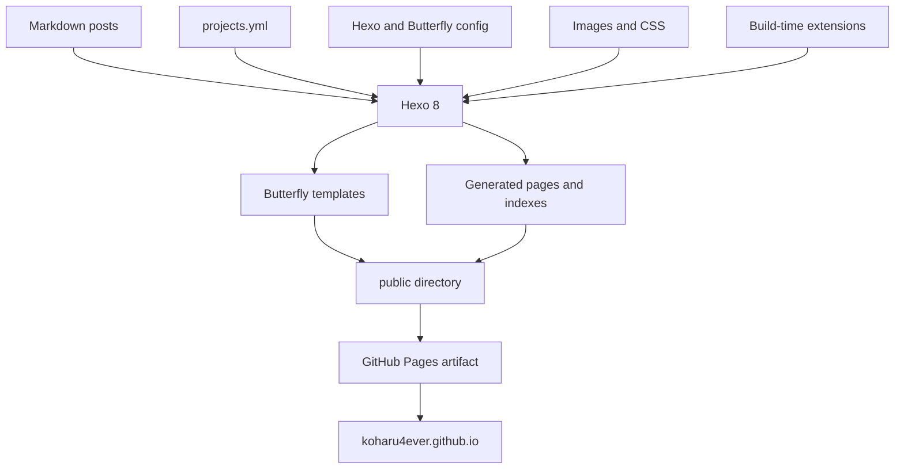

这个网站交付给浏览器的仍然只是 HTML、CSS、JavaScript、图片和 XML。它没有应用服务器，也没有为了做项目页或技术档案引入 React。

但我也不再把它理解成“几篇 Markdown 加一个主题”。Notes、Project Database、首页入口、随机文章、Dev Container 和 Pages workflow 已经组成了一条明确的生成链路。把边界画出来，主要是为了以后知道一项内容应该在哪里改，也知道出错时应该从哪一层开始找。

## 为什么要从旧的静态产物重新开始

重建之前，GitHub 仓库中仍然有旧站生成后的 HTML、CSS、JavaScript 和年月目录，网站也能继续访问。缺失的是生成它们的 Hexo 源码、主题配置和依赖清单。

这很像只保存了编译结果：可以临时改一段 HTML，却无法可靠地新增文章、重建分类和 RSS，也无法确认一台新电脑能否生成相同网站。

所以我没有继续把生成物当作手写源码，而是重新建立：

```text
可编辑的内容和配置
  -> 可重复的构建过程
  -> 可丢弃、可重新生成的 public/
```

旧页面“还能打开”和项目“还能维护”是两件不同的事。现在 `main` 保存可维护所需的源码，GitHub Pages 只接收构建时产生的 artifact。

## 完整的数据流



可以把它分成四层：

1. **事实源**：Markdown、YAML、配置和图片；
2. **构建层**：Node 22、pnpm、Hexo 8 和仓库内的扩展脚本；
3. **表现层**：普通博客使用 Butterfly 与 `custom.css`；Project Database 使用独立的 Tabler 页面与 `project-database.css`；
4. **交付层**：GitHub Actions 生成 artifact，GitHub Pages 托管结果。

复杂度主要在构建期。访客打开页面时，不需要再向一套内容 API 请求数据，也不需要在浏览器里临时拼出项目记录。

## 源码中分别保存什么

### Markdown 保存文章

文章位于：

```text
source/_posts/
```

Front Matter 保存标题、日期、封面、分类以及可选的项目关系，正文保存真正的内容。文件名会参与永久链接，因此它更接近稳定 ID，而不是随时修改的显示标题。

### YAML 保存项目事实

Project Database 使用：

```text
source/_data/projects.yml
```

这里保存 `P-001` 之类的 record ID、状态、技术资料、外链、启动条件、配置、系统边界和历史。项目首页、详情页、数量与技术索引都从同一份数据生成。

这样新增 P-004 时只需要描述事实，不需要复制一份 Kita 的 HTML，再为新项目设计同样的外观。

### 图片和样式负责表现

图片源位于 `source/img/`，站点定制集中在：

```text
source/css/custom.css
source/css/project-database.css
```

Butterfly 仍然负责普通博客页面和主题基础，相关定制集中在 `custom.css`。Project Database 是独立生成的 Tabler 子界面，样式集中在 `project-database.css`。两者都不直接修改 `node_modules/hexo-theme-butterfly`；更新依赖时，这条边界比“当前能显示”更重要。

## 构建期扩展解决了什么

Hexo 会在启动时加载仓库根目录的 `scripts/`。这些 JavaScript 运行在 Node 构建进程里，不是发送给每位访客的应用代码。

当前扩展大致做三类工作：

```text
生成独立 URL
  Project Database、随机文章索引

把内容集合渲染进页面
  Technical Notes archive

在主题输出完成后做小范围注入
  首页 Start Here
```

它们存在的原因不是“静态站也要写复杂代码”，而是同一份事实需要稳定地出现在多个页面。

Project Database 是最直接的例子：`projects.yml` 中的一条记录需要同时进入 `/projects/`、对应详情页、Technology Index 和 Recent Activity。构建期一次生成完整 HTML，比在四处复制内容或让浏览器启动后再请求 JSON 更容易验证。

### Generator 的边界

生成器负责固定结构和可重复计算：

- 根据 slug 生成 URL；
- 确保 record ID 不缺失且不重复，并校验技术引用和文章的 project 关联；
- 输出共同的 HTML 语义；
- 汇总项目数量、技术数量和活动事件。

它不应该替作者判断：

- 一个项目真正解决什么问题；
- 哪些系统边界值得画出来；
- 哪些文章值得作为项目的 Engineering Notes；
- 某次故障是否值得进入 history。

也就是说，代码拥有布局，YAML 和 Markdown 拥有事实，编辑判断仍然由人完成。

## Dev Container 只负责可重复的开发环境

宿主机不安装 Node、pnpm 或 Hexo。Dev Container 提供固定的 Node 22 环境，并以 `node` 用户访问工作区。

```text
VS Code / Docker
  -> Dev Container
  -> pnpm dev or pnpm check
  -> local public/
```

这个容器不是生产服务器。删除并重建开发容器不会删除文章源码，线上访客也不会连接它。

把日常用户固定为 `node` 同样是架构边界的一部分。若某次用 root 生成 `public/`，下一次 `hexo clean` 就可能无法删除 `atom.xml`；这是文件所有权问题，不是 Hexo 或 RSS 本身坏了。

## GitHub Actions 与 Pages 分别负责什么

推送到 `main` 后，workflow 会重新安装依赖、运行构建、上传 `public/` artifact，再调用 Pages deployment。

```text
main source
  -> GitHub Actions build
  -> temporary Pages artifact
  -> GitHub Pages
```

仓库不会把 `public/` 写回分支，也不再使用 `hexo deploy` 在本地维护另一套发布状态。

这让两类问题可以分开判断：

- build 失败：源码、依赖、配置或生成器有问题；
- build 成功而 deploy 失败：Pages 权限、环境审批或 GitHub 的部署服务有问题。

本地 `pnpm check` 能证明源码可以生成站点，却不能替 GitHub Pages 证明 OIDC token 或部署环境一定正常。

## 浏览器端 JavaScript 为什么保持很小

页面主要内容在构建完成时已经存在。浏览器脚本只增强那些确实需要状态的行为，例如 Notes 的搜索、过滤、分页和五种视图，以及随机文章按钮。

即使这些增强失败：

- 普通文章仍然是普通链接；
- 项目事实仍然出现在 HTML 中；
- 搜索引擎和辅助技术仍能读取主要内容；
- 页面不会因为缺少客户端框架而变成空壳。

这也是我刻意没有把博客迁移到 Next.js 的原因。Kita 需要应用运行时，这个站点的核心需求则是生成、归档和阅读静态内容。两者可以共享工程经验，不必共享框架。

## 从症状判断应该检查哪一层

```text
文章正文或 Front Matter 错误
  -> source/_posts

项目事实、关系、启动条件或配置错误
  -> source/_data/projects.yml

所有项目共同结构错误
  -> scripts/project-database.js

普通博客的颜色、间距或移动端错误
  -> Butterfly config / source/css/custom.css

Project Database 的颜色、间距或移动端错误
  -> source/css/project-database.css

本地无法构建
  -> Dev Container / dependencies / source validation

线上没有更新
  -> GitHub Actions build / Pages deploy
```

这张排错地图是给这套架构最实际的回报。它不能消灭问题，但能避免因为一个链接没进入项目页，就同时修改 Markdown、CSS 和部署 workflow。这套系统可以继续长出新的内容视图，但每个视图仍回到同一组可读、可版本控制、可重新生成的源码。
